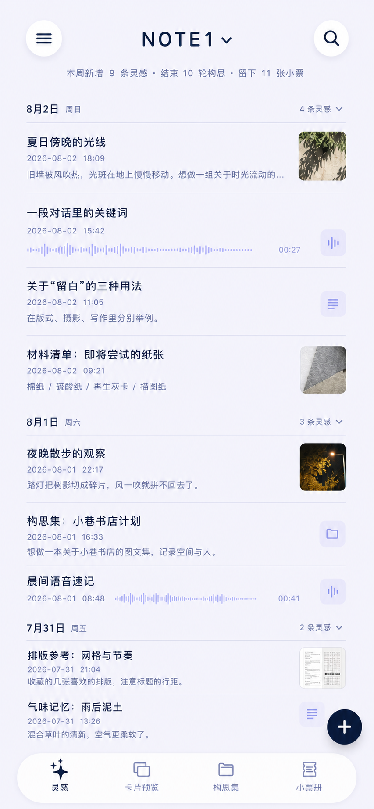
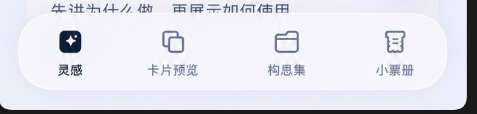
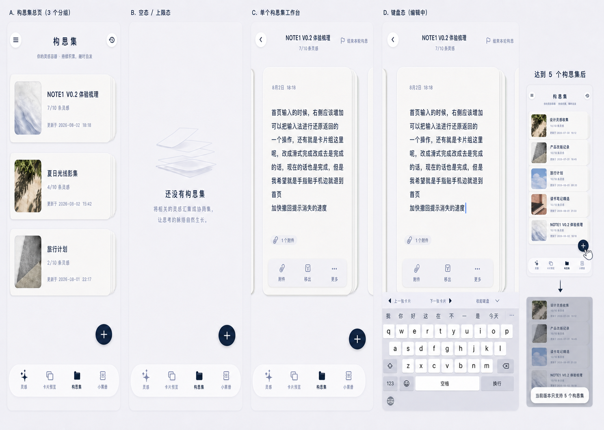

# NOTE1 V0.2 产品设计与交互规格（UI/UX Design Specification）

> 产品版本：V0.2  
> 文档状态：现役视觉与交互基线  
> 更新日期：2026-08-02  
> 产品规则来源：`NOTE1_PRD_V0.2.md`  
> 非回归来源：`docs/03_工程/V0.2/现役规范/NOTE1_V0.1到V0.2能力非回归矩阵.md`

## 0. 文档职责与解释顺序

本文件不是第二份 PRD。它把 PRD 已经确认的页面和能力，翻译为可以直接设计、实现和截图验收的视觉与交互规格，回答以下问题：

- 页面必须长什么样；
- 控件位于哪里、以什么状态出现；
- 页面与对象如何跟手移动；
- 哪些 V0.1 成熟能力必须保留；
- 使用哪张确认图或哪段参考动效验收；
- 哪些当前实现属于明确反例。

开发与验收时按以下顺序解释：

1. `NOTE1_PRD_V0.2.md`：产品目标、对象、状态、业务规则和功能边界；
2. 本文件：页面视觉、组件、布局、动效、手势和确认图；
3. `NOTE1_V0.1到V0.2能力非回归矩阵.md`：V0.1 不得丢失的成熟能力；
4. `NOTE1_V0.2_开发准则与注意事项.md`：工程实现与验证方法；
5. 当前代码和当前模拟器截图只代表待验收实现，不反向覆盖以上基线。

发生冲突时，先确认冲突属于产品规则还是表现方式。产品规则回写 PRD；表现方式回写本文件。不得在代码中自行选择其中一个版本。

## 1. 参考资料分级

### 1.1 A 级：NOTE1 直接视觉目标

A 级图可以按同尺寸截图直接对照。实现必须保留其空间关系、颜色气质、控件层级和信息密度。

#### 首页融合确认稿

这张图确认：

- 淡紫冷色画布、深蓝文字与浅亮玻璃组成 V0.2 全局视觉基调；
- 顶部左右圆形按钮对称，`NOTE1⌄` 的文字与三角形成一个整体并垂直居中；
- 周摘要是次级信息，不使用独立大标题；
- 灵感按日期分组，卡片内部只显示正文和必要元数据；
- 底部四个一级入口等宽，选中项为深蓝底，未选中项为蓝灰线性图标；
- 浮动新增按钮与底栏分离，只占用右下方独立空间，不覆盖一级入口。

#### 底部入口与选择按钮

以上两图只确认图标语义、光学尺寸关系和选中态，不允许把截图中的局部裁切、背景尺寸或抗锯齿当成独立布局依据。

### 1.2 B 级：交互结构参考

B 级图只负责指定的交互关系，不是 NOTE1 的最终主题，不得整体照搬其颜色、品牌、字号或信息架构。

| 本地参考 | 只借鉴 | NOTE1 不照搬 |
| --- | --- | --- |
| [flomo 侧栏](视觉基线/11-交互参考-flomo侧栏.jpg) | 左上统一入口打开低频功能 | 账号统计、标签树、AI、每日回顾 |
| [PikPak 全局搜索](视觉基线/12-交互参考-PikPak全局搜索.png) | 搜索框位于顶部，筛选紧邻其下 | 云盘文件类型和 Share 分类 |
| [PikPak 已选筛选](视觉基线/13-交互参考-PikPak筛选状态.jpg) | 已选范围可辨认、可移除 | 其灰色主题和尺寸 |
| [PikPak 页面范围搜索](视觉基线/14-交互参考-PikPak范围搜索.jpg) | 搜索框明确显示当前对象范围 | 文件夹业务文案 |
| [PikPak 顶部操作](视觉基线/15-交互参考-PikPak顶部操作.PNG) | 搜索和页面操作保持稳定位置 | 新建文件夹和三点菜单结构 |
| [PikPak 选择菜单](视觉基线/16-交互参考-PikPak选择菜单.PNG) | 低频选择从菜单进入 | 只有一个动作仍套“更多” |
| [X 底部导航](视觉基线/17-交互参考-X底部一级导航.PNG) | 稳定一级页面入口与独立新增按钮 | 社交信息流和黑白品牌视觉 |

### 1.3 C 级：动效与物理关系参考

- 构思小票出票：Uiverse `Print Receipt Card`；
- 出票后的结果收束：`New Payment Receipt`；
- 小票前后层级与换票：`Ticket Stub Cards Microinteraction`；
- SwiftUI 叠层吸附：`SwiftUI Stacked Carousel`；
- 下拉抽取和后方纸张补位：`SwiftUI soft physical deck interaction`。

本地静态图、来源职责和否决条件见 `docs/90_历史归档/V0.2/实施与任务/NOTE1_V0.2_小票册视觉参考与实现对照.md`。这些来源决定对象关系和运动意图，NOTE1 最终仍使用本文件的颜色、材质和信息层级。

### 1.4 D 级：明确反例

以下证据用于说明“不能做成什么样”，不能被开发人员当成视觉参考：

- `evidence/V0.2/V0.2_UI审计_2026-08-02/` 中的当前 V0.2 截图；
- 普通纯白系统卡片、默认系统蓝按钮、实灰底栏；
- 底部按钮和浮动新增按钮重叠；
- 卡片预览大面积纯白、相邻正文透出、操作区被底栏遮挡；
- 构思集使用大面积管理表单或松手后才突然出现的系统 Sheet；
- 小票册使用普通列表、短卡片摘要、文件网格或瀑布流代替长条小票。

## 2. 全局设计系统

### 2.1 设计气质

NOTE1 的界面应当安静、清冷、轻盈、具备纸张和玻璃的触感。它不是效率看板，不使用高饱和激励色、粗重卡片、密集分割线、浮夸庆祝或模板化大胶囊。

判断一处 UI 是否符合 NOTE1，优先检查：

1. 主体是否仍是内容，而不是容器和按钮；
2. 默认状态是否浅亮而非发灰或刺眼纯白；
3. 深蓝是否只用于文字、图标和当前选中状态；
4. 阴影是否只帮助区分纸张层级，而不是制造悬浮白块；
5. 页面切换后顶部、底部和主要操作位置是否保持稳定。

### 2.2 语义颜色

| 变量 | 基线 | 使用范围 |
| --- | --- | --- |
| `noteInk` | 深海军蓝，约 `#071B34` | 主标题、正文、关键图标、选中态 |
| `noteSecondaryInk` | 蓝灰，约 `#7D8EAF` | 时间、说明、不可用状态 |
| `noteCanvasTop` | 极浅冷白紫，约 `#F7F7FF` | 背景上端 |
| `noteCanvasBottom` | 淡紫，约 `#EBECFF` | 背景下端 |
| `notePaper` | 带轻微紫调的纸白 | 灵感纸张、卡片和小票纸 |
| `noteGlass` | 半透明浅亮玻璃 | 顶部按钮、底栏、录入工具栏 |
| `noteSelected` | `noteInk` | 当前一级入口和明确主操作 |
| `noteDanger` | 受控系统红 | 永久删除与破坏性确认 |

规则：

- 默认按钮不能因为降低亮度而直接变灰；只有按下瞬间轻微染成蓝灰并缩放；
- 纯白只能作为纸张高光，不得铺满按钮、底栏和大面积内容区；
- 禁止让系统 tint 自动变成亮青蓝；
- iOS 17–25 材质降级和 iOS 26 Liquid Glass 必须使用同一组语义颜色。

### 2.3 尺寸、间距与命中

- 基准对照视口：iPhone 15/16 Pro 逻辑尺寸约 393 × 852；同时在 368 × 800 小视口复验不遮挡。
- 页面水平安全边距使用同一共享变量；标题、卡片、底栏不得各自漂移。
- 顶部圆形按钮视觉直径约 48pt，实际命中区至少 48 × 48pt；左右按钮的视觉中心位于同一水平线。
- 底部四个入口各占底栏宽度的四分之一，整个单元格都可点击；不得只有图标本体可点击。
- 所有交互目标不得小于 44 × 44pt；Dynamic Type 放大时优先增加容器高度，不压缩命中区。
- 同级内容使用 8pt 节奏；页面分区使用 16/24pt 节奏；禁止为对齐单个截图散落大量互不相关的固定 padding。

### 2.4 字体与信息层级

- 使用系统语义字体和 Dynamic Type，不引入装饰性字体；
- 页面标题、卡片正文、构思集名称、时间元数据必须是四个清楚层级；
- 普通灵感正文不得与构思集名称使用同一标题字号；
- 时间和对象归属使用蓝灰，但必须达到可读对比度；
- 中文与英文混排不改变行高，不因英文内容把卡片撑出异常大空白。

### 2.5 通用组件状态

所有共享按钮、底栏入口、纸张卡片和筛选控件必须提供：默认、按下、选中、禁用、加载、降低透明度、减弱动态效果和 VoiceOver 状态。

- 默认：浅亮、可识别，不发灰；
- 按下：轻微蓝灰染色和约 0.97 的短促缩放，不闪白；
- 选中：深蓝建立清楚状态，不扩大控件；
- 禁用：降低对比但保留边界和语义；
- 焦点/VoiceOver：不靠颜色单独传达状态。

## 3. 全局页面外壳

### 3.1 顶部栏

- 一级“灵感”页：左为统一功能入口，中间为 `NOTE1⌄`，右为搜索；三者在同一视觉基线上。
- `NOTE1` 与下拉三角是同一个可点击整体；三角不能单独下沉或与文字脱节。
- “构思集”和“小票册”页面名称居中；不得使用当前左对齐大标题。
- 卡片预览名称居中；页面不常驻搜索按钮。
- 页面进入搜索、选择、详情或编辑状态时，顶部栏切换为对应状态，不在原顶部栏上叠一层灰色背景。

### 3.2 底部一级导航

- 固定为“灵感 / 卡片预览 / 构思集 / 小票册”，顺序不变；
- 浅亮悬浮玻璃容器，四个单元等宽；
- 选中图标使用深蓝小圆角底，文字深蓝；未选中为蓝灰线性图标；
- 点击命中覆盖整个四分之一单元；
- 入口切换使用 160–220ms 的轻微材质和缩放过渡，不弹跳、不闪白；
- 内容底部必须使用同一个 `safeAreaInset` 为底栏保留空间。

### 3.3 浮动新增按钮

- 浮动“+”出现在“灵感”“卡片预览”和“构思集”三个一级页面；“小票册”不显示新增按钮；
- 三页使用相同的右下角悬浮位置、光学尺寸和按压反馈，但分别执行“新增灵感”“新增卡片”“新建构思集”；
- 按钮覆盖在当前内容层之上，只避开底栏、键盘与安全区；不得为按钮预留独立槽位、空白模块、固定空白行或压缩正文可用空间；
- 搜索、选择、录入、附件选择、详情和键盘编辑状态下隐藏。

### 3.4 一级页面横滑

- 四页按固定顺序横滑切换且首尾不循环；
- 灵感与构思集总页可在未命中内容控件时整页横滑；
- 卡片预览和小票册只从保留边缘切换一级页，对象手势优先；
- 底部点击始终是等价且可见的兜底路径。

## 4. 分页面规格

### 4.1 灵感首页

**直接视觉目标：** 第 1.1 节首页融合确认稿。

页面从上到下为：

1. 稳定顶部栏；
2. 最近 7 天成果摘要；
3. 按日期分组的全部独立灵感；
4. 右下浮动新增按钮；
5. 底部四入口。

规则：

- 摘要使用一行小号蓝灰文字，不增加“最近回声”等标题；全为 0 时整行隐藏；
- 日期是分组标题，卡片内只保留时间和必要归属；不增加左侧时间轴圆点；
- 卡片采用可变高度纸张。短内容紧凑，长内容显示 1–3 行摘要；
- 照片、语音、PDF 和文件使用轻量附件摘要，不能把时间流变成图库或文件管理器；
- 卡片主体点按进入完整灵感编辑，不常驻“编辑”胶囊；
- 选择模式从左上统一入口进入，不能给左上按钮叠一块灰色方形背景。

### 4.2 录入面板

- 点按“+”后从底部出现聊天式录入面板，背景只做必要遮罩；
- 主体是可多行自适应文字区，工具行包含照片、文件、语音灵感和保存；
- 键盘右上或工具栏提供明确的收起键盘操作；用户向下滑动正文或面板也可交互式收起键盘；
- 长文字时文字区内部可滚动，光标和正在输入内容保持可见，按钮不与文字重叠；
- 保存按钮、附件按钮在安全区内始终可达；保存后返回首页并出现新灵感，不产生蓝色残留选中态；
- 语音灵感和音频附件均可播放，来源语义按 PRD 第 6 节区分。

### 4.3 搜索

**交互参考：** 第 1.2 节 PikPak 搜索系列。

- 搜索框固定在页面上方，筛选项紧邻其下，结果从上向下自然展开；不得把搜索框放到底部；
- 从灵感页进入默认范围为“全部”，显示“全部 / 灵感 / 构思集 / 小票”；
- 从构思集或小票册进入时，输入框或范围标签明确显示当前对象；
- 已选择的范围可辨认且可移除；
- 点按搜索结果必须进入真实灵感、构思集或小票对象；
- 取消完成后返回来源页与原滚动位置。

### 4.4 卡片预览

**A 级确认图：**

该图同时冻结卡片默认态、左滑“收起”反馈、构思集长按展开、松手后的新建面板、现有构思集列表与满额失败提示。开发验收以图中空间关系和下述文字规则共同为准；图中文字若因生成误差与本文件冲突，以本文件标准文案为准。

当前产品决策：卡片预览只承载未归入构思集的独立灵感；构思集及其成员不在卡片预览中重复显示，统一从“构思集”一级入口进入工作台。下述构思集按钮指当前独立灵感的归入操作，不表示构思集代表卡片。

页面从上到下为：居中标题、铺满主区域的纵向叠卡对象（下沿贴近底部一级导航上沿）、悬浮在当前卡片底部的构思集入口、可选浮动新增按钮、底部一级导航。

- 整体使用淡紫画布；当前纸张为带轻微紫调的纸白，不得用纯白大块压住主题；
- 当前卡片完整可读，前后只露窄纸边，不泄露相邻正文；
- 正文使用正文层级，不使用构思集标题字号；
- 主卡片不因短文缩成短卡，也不在卡片下方生成独立空白模块；其高度跟随标题下方到一级导航上沿的可用区域；
- 构思集入口悬浮在当前卡片底部，保持稳定单手命中区；长按展开的目标从按钮上方出现，不被底栏遮挡；
- 上下拖动跟手切卡，方向锁定后不被轻微横移误触；
- 独立灵感左滑接近阈值后才逐渐显示低饱和“收起”背景，越阈值后收起并显示约 2 秒撤回条；轻滑不提前显示强烈状态；
- 点按独立灵感进入完整专注编辑页面，不使用简化弹窗替代；返回后保持当前卡片位置。

### 4.5 灵感完整编辑

- 使用完整页面层级，保留系统左边缘返回和可见返回按钮；
- 自动聚焦正文，内容自动保存，返回前不要求额外“保存”步骤；
- 底部“添加附件”和“完成”在同一操作行并避开键盘；
- 可添加照片、文件和音频附件；已添加附件可预览、播放或移除；PDF 和文件通过系统 Quick Look 打开；
- “完成”只结束本次编辑并返回，不执行收起；
- 编辑返回、切换一级页和 App 重启后，卡片预览恢复到原对象，而不是只恢复可能变化的数组下标。

### 4.6 快速归入构思集面板

- 卡片预览保留 V0.1 的单一圆形构思集按钮；按钮悬浮在当前卡片底部，不新增两个常驻按钮或独立操作槽；
- 长按后从按钮上方向外出现最多两个较大的拓展目标：“新建构思集”和“归入现有构思集”。两个胶囊目标左右对称、向外轻微倾斜并柔和悬浮；目标之间及目标与圆形按钮之间不得出现弧线、虚线、箭头或其他连接线；
- “新建构思集”位于左上方并轻微逆时针倾斜；“归入现有构思集”位于右上方并轻微顺时针倾斜。拓展目标是操作类型，不直接展示具体构思集；
- 无论当前已有多少个构思集始终显示两个目标；达到 5 个构思集时仍保留“新建构思集”目标，点按确认后提示容量限制；已有 0 个构思集时“归入现有构思集”进入空列表提示；目标数量变化时保持按钮中心和展开方向稳定；
- 手指只拖拽一次：从圆形按钮移动到某个拓展目标并松手。松手后拖拽阶段结束，再打开对应的点击式面板；
- 选择“新建构思集”后打开新建面板；选择“归入现有构思集”后打开名称与 `当前数量/10` 列表，具体构思集由点按选择，不要求第二次拖动；
- 新建面板和现有列表使用淡紫玻璃、清楚行高和受控阴影，不使用纯白大 Sheet、3 × 2 管理宫格或覆盖卡片的大色块；
- 已满行保持可见并呈不可接收状态；点按后在列表附近显示“当前版本每个构思集只支持 10 条灵感”，保留列表和当前卡片，不误关闭、不写入；
- 长按时按钮本体保持原位；手指离开拓展目标立即取消高亮；拓展目标外松手只关闭本次拖拽；
- 点按按钮和 VoiceOver 自定义操作提供等价入口，最终仍通过新建面板或现有列表点按完成操作。

### 4.7 构思集总页与构思历程

**A 级确认图：**

该图冻结构思中列表、空态、满额点击提示、工作台默认态和键盘态。图中文字若与本文件标准文案冲突，以本文件为准。

- “构思集”标题居中；右上可放搜索或构思历程入口，但必须使用共享圆形按钮；
- 页面只展示构思中的构思集，不混入已结束内容；
- 新建构思集使用右下角悬浮“+”，与灵感页和卡片预览保持同一位置与组件；按钮不得占据独立模块或制造额外留白；
- 空态仍显示右下角悬浮“+”；达到 5 个构思集时按钮仍可见，点按后从页面下方短暂提示“当前版本只支持 5 个构思集”，不得把该提示作为空态常驻文案；
- 点入已有构思集直接进入工作台，不先进入 CRUD 管理页；
- 构思历程展示已结束构思集和历次轮次，支持继续构思；不与小票册重复管理同一列表；
- 本页的右下悬浮“+”只负责新建构思集，不执行新增独立灵感。

### 4.8 构思集工作台

- 与卡片预览复用纸张和纵向叠卡语言，但进入即是集中构思，不增加第二个“专注编辑”入口；
- 支持组内最多 10 张卡片快速切换、原位编辑、调整顺序、移出、附件访问和新增组内灵感；
- 键盘出现时纵向手势滚动正文，暂停切卡；键盘工具栏提供前后卡片操作；
- 键盘编辑态隐藏右下角新增卡片按钮；键盘收起后恢复，不把新增按钮塞入键盘工具栏；
- 非键盘态使用右下角悬浮“+”新增组内卡片，按钮不占据独立模块、不制造页面空白；
- 上一张和下一张只露纸边，不用 `①②③` 或大号页码占据主视觉；
- 结束本轮构思是构思集级动作，组内单卡左滑不得结束整轮；
- 使用淡紫背景和 NOTE1 纸张，不退化为大面积纯白系统 Sheet。

### 4.9 构思小票生成

A 级动效关键帧：

动画顺序是数据完成后的结果表现：

1. 用户确认结束；
2. 当前轮次和不可变小票快照原子保存；
3. 固定夹口出现准备反馈；
4. 小票连续出纸，内容随纸张推进逐步显现；
5. 小票在屏幕内减速并停止收束；
6. 一次轻触觉；
7. 显示进入小票、返回和短时撤回。

四个验收阶段固定为“确认 → 准备 → 连续出纸 → 停止收束”。准备态只露出小票纸头；连续出纸态中内容随已展开纸面逐步显现，不允许整张小票在松手后突然出现；停止收束后才显示“查看小票 / 返回 / 撤回（约 2 秒）”。

不得先播动画后写数据；中断、退后台或 Reduce Motion 不得重复生成。减弱动态效果改为短距离展开和淡入。

### 4.10 小票册

- A 级视觉基线：

#### 2026-08-02 最终视觉确认

本轮确认以方案 2 为最终结构，并吸收此前方案中较自然的票据层级与纸张质感。确认图同时约束根页、长票、档案导轨、左右换票以及右上“更多”菜单，不允许开发时拆开选用。

- 保留单张长票作为页面主对象，不改回普通卡片、短摘要列表或文件网格；
- 页面底部不设置附件、导出、分享等常驻操作区，也不得因此为工具栏预留大片空白；
- 右上原“选择”位置改为三点“更多”，选择只是菜单内的一项；
- 附件、模板、导出 PDF、分享、复制、查找和删除统一从“更多”进入；
- 小票册没有右下新增按钮，底部一级导航不得覆盖小票或操作命中区；
- 后续实现与验收只使用上述确认图，早期含底部工具栏、短票或独立“选择”按钮的方案全部作废。

- “小票册”标题居中；右上使用两个共享圆形图标按钮，分别为搜索与三点“更多”；不常驻独立选择按钮；
- 点按“更多”后从按钮下方弹出紧凑的浅亮玻璃菜单，依次提供选择、切换模板、导出 PDF、分享、复制、在小票中查找和删除；删除使用红色语义色；
- 根页和详情均不在小票底部或屏幕底部常驻导出、分享、复制、查找、删除工具栏；
- 本页不显示右下全局新增灵感按钮；
- 根页面采用票据夹、当前长条小票和后方纸张露边的单焦点构图，不使用普通列表、网格或短白卡；
- 当前小票必须呈现完整长条内容，不只截取顶部短摘要。页面本身允许纵向滚动阅读当前小票；文字、照片和附件摘要按真实内容自然延长；
- 左右滑动当前小票切换前后票，方向锁定后不干扰当前票的纵向阅读；首尾不循环；
- 下拉抽取只从票据夹/顶部把手开始，或仅在当前票已滚动到顶部且明确向下拖动时生效，避免与长票纵向滚动冲突；点按小票仍可进入详情；
- 向下抽取时当前票、夹口和后方纸张同步跟手，过阈值进入详情，未过阈值回弹；
- 经典票与胶卷票混合浏览，照片票保留可辨识比例；
- 页码和结束时间是次级信息，不使用“上一张/下一张”两个大灰按钮。

### 4.11 小票详情

- 顶部使用可见返回按钮、居中标题和右上三点“更多”；操作项与根页共用同一菜单结构；
- 详情承接附件打开、模板切换、导出 PDF、系统分享、复制文本、来源轮次和“在小票中查找”；
- 详情与根页面使用同一份完整小票数据，不重新生成内容；
- 小票快照固定，原灵感之后编辑或删除不改变旧票；
- 照片、音频、PDF 和文件必须可进入真实预览或播放；
- 左边缘右滑和可见返回按钮返回小票册，并恢复原小票位置。

### 4.12 左上功能入口、选择、设置与回收站

- 左上统一入口打开本机低频功能：选择灵感、回收站、设置；没有第二项时不套一层“更多”；
- 菜单使用和顶部按钮同源的浅亮玻璃，不在圆形按钮外再出现灰色方形背景；
- 选择状态显示取消、已选数量、全选和页面允许的批量操作；
- 设置只包含本机备份与恢复、本机隐私说明、联系我和关于 NOTE1；联系邮箱为 `y2694390075@gmail.com`；
- 回收站说明“在回收站中超过 30 天的灵感将会自动删除”，恢复为独立灵感；空态替换列表而不是覆盖列表。

## 5. 动效与手势统一规则

- 所有核心手势必须在 `onChanged` 阶段产生连续视觉反馈，不能只在松手后突然跳转；
- 一次手势只锁定一个轴；未形成明确方向不改变状态；
- 未越阈值自然回弹，越阈值沿当前方向完成；
- 状态颜色只在接近阈值后渐进出现；
- 阈值首次越过或结果完成时最多一次触觉；
- 页面切换通常使用 180–280ms 的短动画；物理纸张可使用受控弹簧，但不夸张回弹；
- Reduce Motion 使用短位移和淡入，Reduce Transparency 使用不透明浅色底和清晰边界；
- VoiceOver 为收起、放回卡片流、归入构思集、结束本轮、切票和抽取提供等价操作。

## 6. V0.1 非回归视觉与能力门禁

V0.2 改变信息架构和标准名称，不授权删除以下 V0.1 成熟能力：

- 卡片预览左滑时的低饱和状态背景反馈；
- 收起后的撤回条和不阻断继续翻卡；
- 点按卡片进入完整编辑，而不是简化弹窗；
- 自动聚焦、自动保存和返回位置恢复；
- 照片、文件、音频附件的添加、删除、播放和预览；
- PDF/文件 Quick Look；
- 键盘出现时编辑页面仍铺满安全区且按钮可达；
- 顶部圆形玻璃按钮默认浅亮、按下才变化；
- 页面铺满屏幕，不产生底部空白或整个根页面上下弹动。

完整逐项口径以非回归矩阵为准。任何 V0.2 新页面通过截图验收前，必须同时证明相关旧能力没有丢失。

## 7. 实现前视觉检查点

开发不得仅凭本文件文字一次性完成全部 UI。以下检查点必须先生成同尺寸设计稿并获得确认，再进入对应页面最终实现：

| 检查点 | 当前状态 | 开发门禁 |
| --- | --- | --- |
| 灵感首页与全局外壳 | 已有 A 级确认稿 | 可以按图实现并同尺寸对照 |
| 搜索 | 有 B 级交互参考，NOTE1 主题由本文件确定 | 可实现结构；完成后需提交对照图 |
| 卡片预览与完整编辑 | 卡片预览已有 A 级确认稿，完整编辑沿用 V0.1 真实基线 | 按 `20-已确认-卡片预览与构思集一次拖拽状态图.png` 实现卡片与构思集入口；编辑页按 V0.1 非回归矩阵恢复完整附件闭环并提交对照图 |
| 构思集总页、选择面板、工作台 | 已有 A 级确认稿 | 按 `21-已确认-构思集总页与工作台状态图.png` 实现空态、列表、满额提示、工作台与键盘态，并补真实数据对照图 |
| 小票生成 | 已有 A 级关键帧 | 按 `23-已确认-结束本轮构思与小票生成关键帧.png` 实现确认、准备、连续出纸和停止收束；实现后提交完整录屏与 Reduce Motion 录屏 |
| 小票册根页 | 已有 A 级确认稿 | 按 `22-已确认-小票册档案导轨与更多菜单状态图.png` 实现经典票、胶卷票、换票和右上更多菜单，并补空态验收图 |
| 小票详情 | 已有 A 级结构确认稿 | 沿用同一长票、顶部栏和右上更多菜单；实现后补附件真实预览与返回状态对照图 |
| 设置、回收站、选择 | 结构明确，沿用全局组件 | 可实现后通过状态截图验收 |

“缺完整 A 级页面稿”不是允许开发自行补齐的空白，而是视觉门禁。开发人员应先提交设计检查点，由产品确认后再将图片加入 `视觉基线/V0.2/` 并把状态改为“已确认”。

## 8. 截图与动效验收方法

每一阶段必须提交：

1. 使用同一设备、同一尺寸、同一内容状态的目标图与实现图并排对照；
2. 默认、按下、选中、禁用、空态、长内容、附件和最大辅助字号状态；
3. 关键手势的完成与取消录屏；
4. Reduce Motion、Reduce Transparency 和 VoiceOver 等价入口证据；
5. 对照结论，逐项说明空间、颜色、信息层级、动效和能力非回归是否通过。

截图不是唯一验收：静态布局按图对照，手势看完整录屏，数据与附件看自动化和真实操作，真机触觉与边缘手势必须在实体 iPhone 验证。

## 9. 明确否决条件

出现任一项不得标记 UI 完成：

- 用通用白卡、系统蓝、实灰底栏或默认 `.bordered` 代替 NOTE1 组件；
- 底栏、浮动新增、构思集按钮或正文互相遮挡；
- 顶部标题与按钮漂移，`NOTE1` 三角下沉；
- 页面只有小图标可点击，视觉上大面积区域却不响应；
- 搜索框仍位于底部；
- 卡片左滑无背景反馈、撤回、完整编辑或附件闭环；
- 构思集面板松手后才出现、按钮跟手或面板外松手仍误归入；
- 构思集和小票册继续显示全局新增灵感按钮；
- 小票册只显示短白卡或截断摘要，不能看到完整长票；
- 只报告构建或测试通过，没有同尺寸视觉对照和手势录屏。
