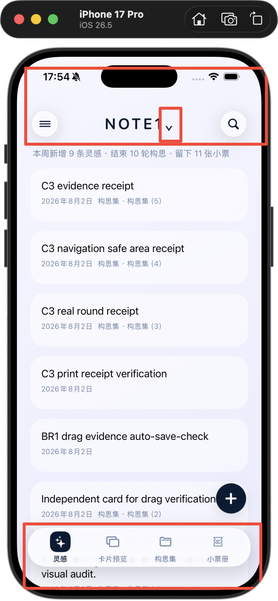
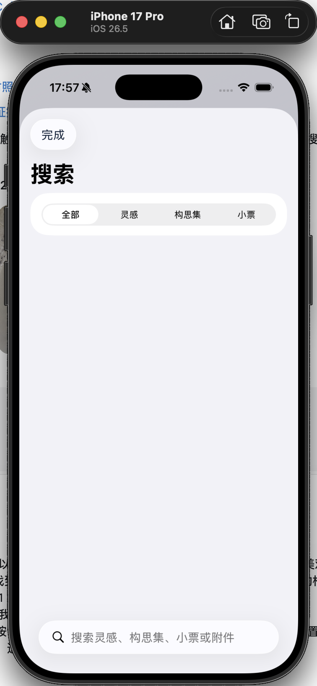
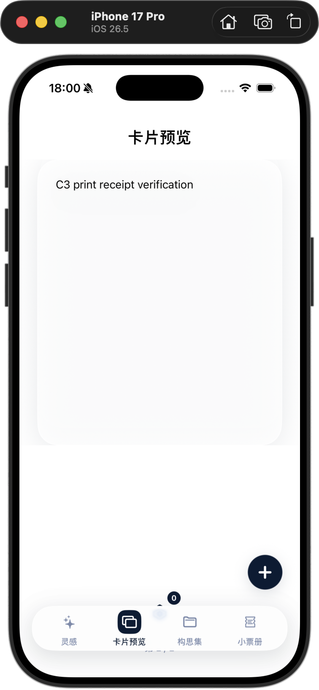
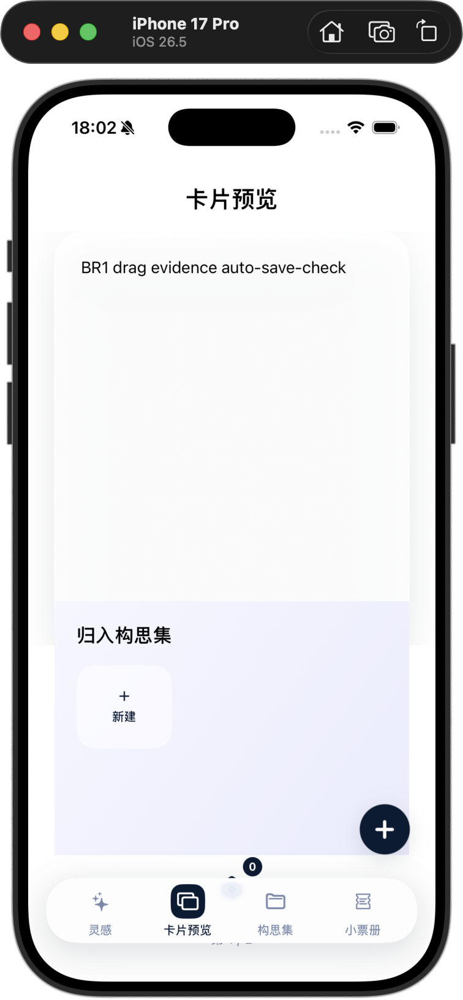
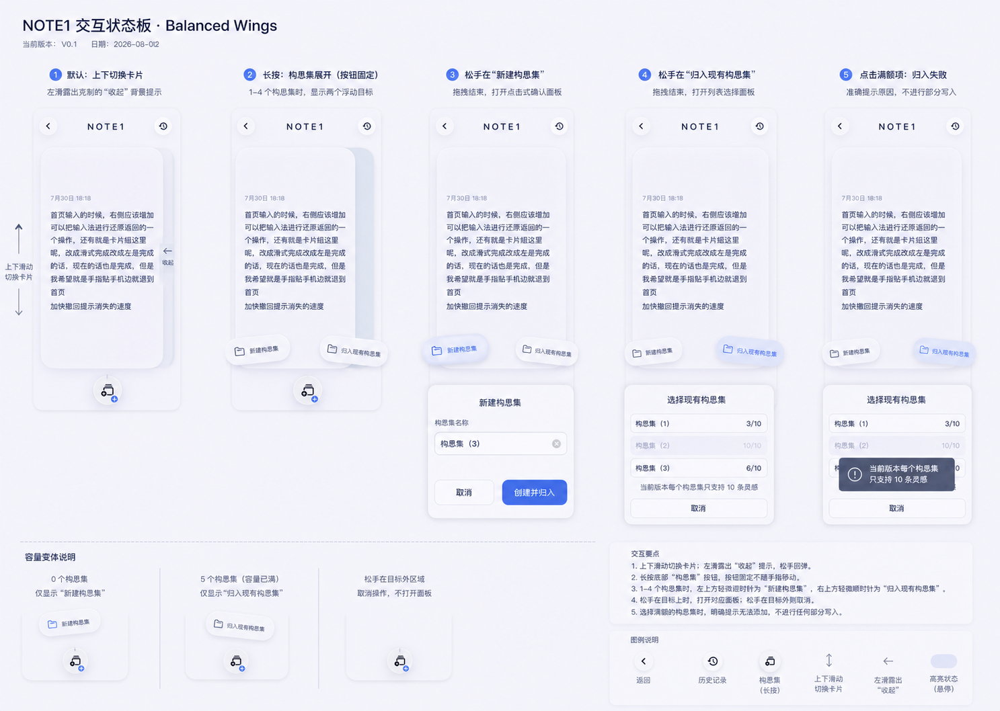
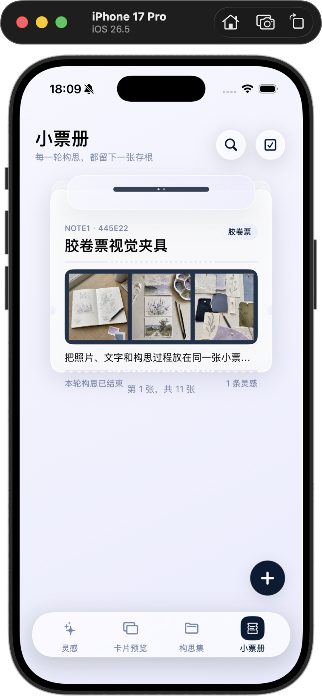
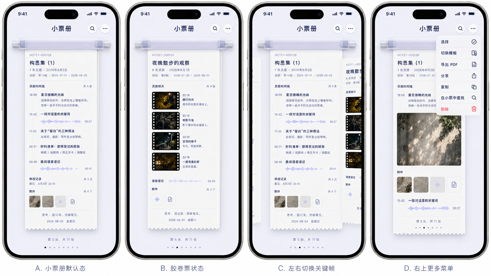
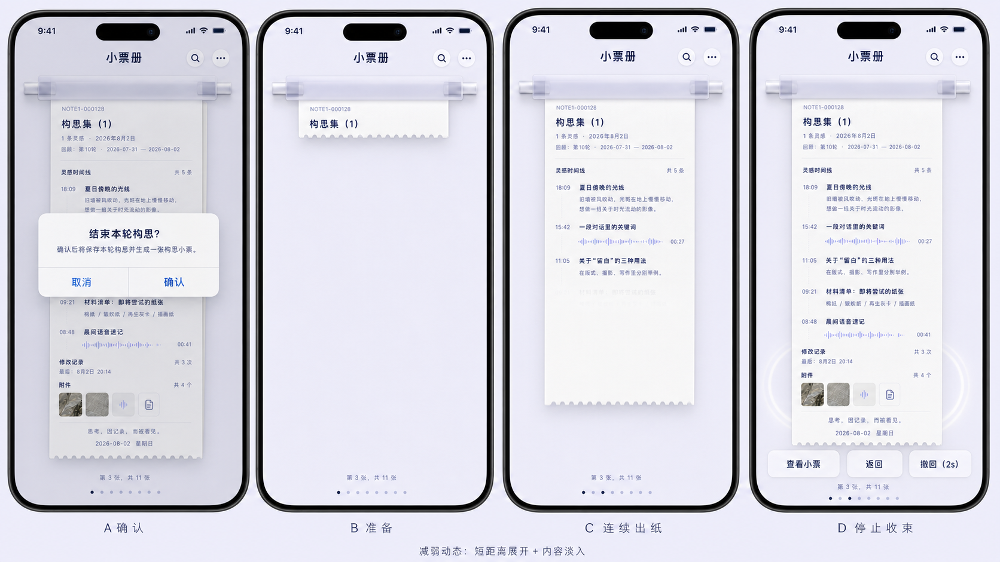

# NOTE1 V0.2 UI 优化 ISSUE

> 状态：现役问题跟踪基线  
> 建立日期：2026-08-02  
> 产品基线：`docs/01_产品/V0.2/NOTE1_PRD_V0.2.md`
> UI/UX 基线：`docs/02_设计/V0.2/NOTE1_V0.2_产品设计与交互规格.md`
> 非回归基线：`NOTE1_V0.1到V0.2能力非回归矩阵.md`  
> 历史审计：`NOTE1_V0.2_UI问题清单_2026-08-02.md`

## 0. 文档职责

本文件只记录当前实现与产品/设计基线之间的差距，不重新定义需求。开发修复、独立复验和用户确认都在同一 ISSUE 下补充证据，避免把现存缺陷重新写入 PRD。

状态统一为：`待处理 / 开发中 / 待复验 / 已关闭 / 暂缓`。只有同时具备代码提交、同尺寸截图、必要录屏和功能验证时，才可从“待复验”改为“已关闭”。

## 1. 当前 ISSUE 总览

| ID | 优先级 | 区域 | 问题 | 状态 |
| --- | --- | --- | --- | --- |
| V02-UI-001 | P0 | 全局外壳 | 首页顶部、底栏和浮动新增位置比例不协调，`NOTE1` 三角下沉 | 待复验 |
| V02-UI-002 | P1 | 左上功能入口 | 点开后圆形按钮外出现灰色方形背景，选择模式视觉不连续 | 待复验 |
| V02-UI-003 | P0 | 搜索 | 搜索框位于底部，标题、筛选与输入分离，交互复杂 | 待复验 |
| V02-UI-004 | P0 | 底部导航 | 四个一级入口实际命中区过小，不能点击整个单元 | 待复验 |
| V02-UI-005 | P0 | 卡片预览 | 主题过白、主卡下方留白失衡、构思集按钮/面板位置错误并被底栏遮挡 | 待复验 |
| V02-UI-006 | P1 | 构思集与小票册 | 页面标题未居中，错误显示全局新增灵感按钮 | 待复验 |
| V02-UI-007 | P0 | 小票册 | 根页只显示短摘要，未显示完整长票；换票和抽取动效不符合确认对象关系 | 待复验 |
| V02-NR-001 | P0 | 卡片收起 | 左滑低饱和“收起”背景反馈丢失 | 待复验 |
| V02-NR-002 | P0 | 灵感编辑 | 点按卡片退化为简化弹窗，完整编辑、自动保存和附件闭环丢失 | 待复验 |
| V02-NR-003 | P0 | 卡片位置 | 归入构思集按钮位置偏高；编辑返回和重启位置恢复未证明 | 待复验 |

## 2. 本轮治理记录（2026-08-03）

本轮治理直接针对当前文件夹 `/Users/yusiyuan/Documents/NOTE1`，不使用其他工作树或模型记忆中的副本。

- `c381c34`：收紧卡片预览导航、卡片布局、构思集操作槽和卡片位置记忆。
- `091364e`：全局页面迁移到原生 `NavigationStack` / `TabView`，统一系统导航与整格命中区。
- `f15dfc8`：小票抽取手势限定在顶部把手区域，避免与长票纵向滚动冲突。
- `2cc1be2`：构思集与小票册入口带入并锁定对应搜索范围，灵感首页保持全局搜索。
- `cc02cd0`：移除构思集页重复的“构思历程”菜单项，保留明确的右上入口。
- `33cda3b`：将构思集工作台顶部改为系统 toolbar；工作台编辑态暂停卡片切换手势，避免 TextEditor 滚动被抢占；卡片预览按对象显示“收起 / 结束本轮构思”，并隐藏构思集卡片上的独立归组入口；归组托盘改为锚定来源按钮；构思历程补齐搜索入口；小票册根页移除多余副标题，出票反馈移除伪造的搜索/更多按钮。
- `f306b01`：工作台结束动作采用系统 toolbar 的可见文字与旗帜图标，保持确认稿的可发现性。
- `b7e3a4e`：卡片预览移除会扩张到整屏的弹性空白，改为受控操作间距，并取消重复的整栏底部预留；页码和构思集入口回到主卡下方的操作区。
- `fe1a70f`：构思集新建入口移回 App shell 的 viewport overlay，避免长列表按内容高度把“+”压到卡片中部；同步更新导航策略测试，构思集恢复为有浮动新建入口。
- 当前正式目录构建与 XCTest：`xcodebuild -project ios/App/App.xcodeproj -scheme App -destination 'platform=iOS Simulator,id=F59FEBE4-16C9-498F-BFB2-0BCF7C36DAC5' -derivedDataPath /tmp/note1-v02-final-audit2 test`，86 项测试、0 失败，`** TEST SUCCEEDED **`。

以上为开发侧修复和模拟器复验记录。按照本文件的关闭规则，代码修复已完成，但仍需补齐同尺寸截图、必要录屏、真机 VoiceOver 和 iOS 17–25 材质降级等证据后，才能将各 ISSUE 从“待复验”改为“已关闭”。截图采用集中批量采集，不作为每轮编译/测试的固定步骤。

## 3. 详细 ISSUE

### V02-UI-001｜全局外壳比例与位置不协调

**证据**

**已确认问题**

- 顶部左右圆形按钮、中心标题和状态栏之间的留白比例不稳定；
- `NOTE1` 右侧三角单独下沉；
- 底栏过厚且内容底部被覆盖；
- 浮动新增按钮和底栏没有形成独立空间槽。

**期望结果**

- 按产品设计与交互规格中的首页 A 级确认稿复刻；
- 顶部三个对象同基线，底栏四等分，浮动新增只在灵感/卡片预览出现且不重叠。

**关闭证据**

- 首页目标图与实现图同尺寸并排；
- 393 × 852、368 × 800 和最大辅助字号截图；
- 四个一级入口和浮动新增实际点击录屏。

### V02-UI-002｜左上功能入口出现灰色外框

**证据**

**期望结果**

- 默认圆形玻璃按钮外不再出现额外灰色方块；
- 菜单、选择和返回状态共享同一顶部组件；
- 默认态浅亮，只有按下瞬间轻微蓝灰染色。

### V02-UI-003｜搜索布局错误

**证据**

**期望结果**

- 搜索框位于页面顶部；
- `全部 / 灵感 / 构思集 / 小票` 紧邻其下；
- 结果列表从上向下展开；
- 页面范围搜索明确显示对象范围，取消后恢复来源位置。

### V02-UI-004｜底部一级入口命中区过小

**期望结果**

- 四个入口各占底栏宽度的四分之一；
- 整个单元格都可点击，不仅图标可点击；
- 命中区至少 44 × 44pt，最大辅助字号下仍互不重叠；
- 点击任意单元中心、图标上方空白和文字周围均能切换页面。

### V02-UI-005｜卡片预览主题、留白和构思集入口错误

**证据**

**A 级目标图**

**已确认问题**

- 当前主卡和页面过白，与淡紫主题脱节；
- 中下部留白没有形成稳定操作层级；
- 构思集按钮过高或被底栏遮挡；
- 弹出区域是普通白色管理区，没有保留 V0.1 单一按钮和轻量拓展目标的关系。

**期望结果**

- 当前纸张使用带紫调的纸白，前后只露纸边；
- 构思集按钮固定在主卡和底栏之间的操作槽；
- 长按后根据当前容量显示“新建构思集”“归入现有构思集”中的一个或两个拓展目标；
- 双目标采用左右对称、轻微向外倾斜的柔和悬浮胶囊，不显示任何连接弧线、虚线或箭头；
- 用户只拖拽一次并在操作目标上松手；随后通过新建面板或现有构思集列表点按完成，不继续拖入具体构思集；
- 按钮不跟手，目标外松手不打开后续面板、不写入；已满构思集给出规定提示。

### V02-UI-006｜构思集与小票册标题和新增按钮错误

**期望结果**

- “构思集”“小票册”标题居中；
- 构思集页右下角使用统一悬浮“+”新建构思集，按钮不占独立模块、不制造额外留白；
- 构思集空态仍显示悬浮“+”；达到 5 个后点按按钮，从页面下方短暂提示“当前版本只支持 5 个构思集”；
- 单个构思集工作台非键盘态显示右下悬浮“+”新增卡片，键盘编辑态隐藏；
- 小票册不显示新增按钮；
- 小票册右上只显示搜索与三点“更多”；选择、模板、导出、分享、复制、查找和删除从“更多”进入。

### V02-UI-007｜小票册没有呈现完整长票

**证据**

**期望结果**

2026-08-02 最终视觉确认：以该图的方案 2 为唯一验收目标。根页和详情不得保留底部附件、导出、分享等常驻工具栏；右上三点“更多”包含选择及全部低频操作。早期短票、独立选择按钮和底部操作区均不再参与实现或验收。

- 根页以票据夹、当前自然高度长票和后方纸边为唯一主对象；
- 当前票可以纵向阅读完整文字、照片和附件摘要，不固定裁成短卡；
- 左右换票跟手且首尾不循环；
- 下拉抽取从夹口/顶部把手触发，或只在票已回到顶部且方向明确时触发；
- 根页与详情均不常驻底部操作栏；右上“更多”承接选择、模板、导出、分享、复制、查找和删除；
- 小票详情承接附件、模板、导出、分享、查找和来源关系。
- 结束本轮确认后先原子保存，再按“准备 → 连续出纸 → 停止收束”播放；不得突然跳出完整小票或重复生成。

**关闭证据**

- 空态、单票、三票、长文字票和胶卷票同视口截图；
- 左右换票完成/取消、长票纵向滚动、下拉抽取完成/取消原生录屏；
- Reduce Motion 录屏。

### V02-NR-001｜左滑收起背景反馈丢失

- 接近提交阈值后才逐渐显示低饱和“收起”背景；
- 未过阈值恢复原位，不显示成功反馈；
- 过阈值连续离场，并显示约 2 秒“已收起 / 撤回”；
- 正常上下切卡不得偶发触发横向状态。

### V02-NR-002｜完整灵感编辑与附件闭环丢失

- 点按独立灵感进入完整页面，不使用简化 Sheet；
- 自动聚焦、停止输入后自动保存、返回前保存；
- 底部同一行提供“添加附件”和“完成”；
- 照片、文件和音频可新增、显示、移除和预览；PDF/文件使用 Quick Look；
- 编辑返回后仍停留在原卡片。

### V02-NR-003｜构思集按钮与卡片位置恢复

- 构思集按钮位于单手可达的稳定底部操作槽，不贴近页面中部或底栏；
- 当前卡片使用稳定对象 ID 保存；
- 编辑返回、一级页面切换和 App 重启后尽量恢复到同一对象；
- 当前对象已删除时才回退到最接近的有效卡片。

## 4. 开发与复验顺序

1. 全局外壳：V02-UI-001、002、004、006；
2. 搜索：V02-UI-003；
3. 卡片与编辑非回归：V02-UI-005、V02-NR-001、002、003；
4. 小票册：V02-UI-007；
5. 全量设备、辅助功能和附件样本复验。

每批只能把相关 ISSUE 改为“待复验”。独立复验通过后，才标记“已关闭”。
