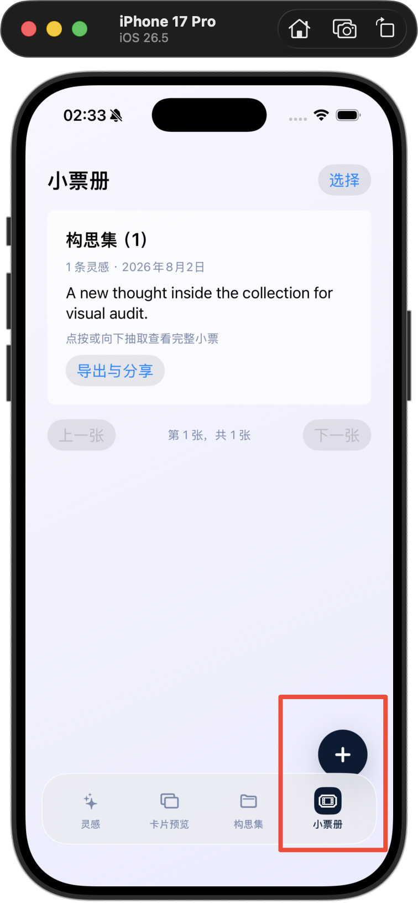
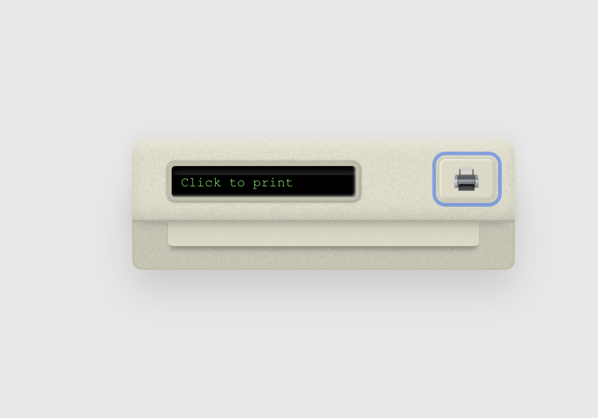
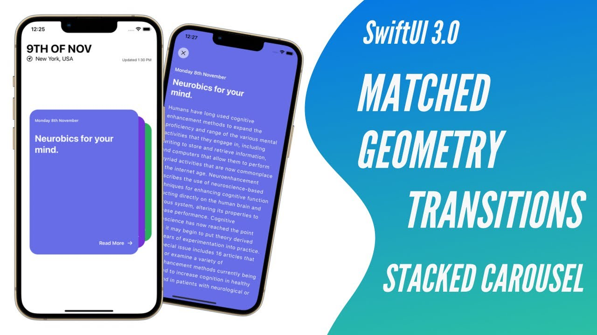

# NOTE1 V0.2 小票册视觉参考与实现对照

> 状态：P0-C 开发与验收的强制视觉交接文件  
> 产品基线：`../产品文档/NOTE1_PRD_V0.2.md`  
> 现役页面视觉基线：`../产品文档/NOTE1_V0.2_产品设计与交互规格.md`  
> UI 执行基线：`NOTE1_V0.2_UI二次优化手册.md`  
> 本文件不新增产品范围，只负责小票对象、出票、换票和抽取的来源映射。根页面完整长票、标题、导航和新增按钮规则以现役产品设计与交互规格为准。

## 1. 为什么补充本文件

当前 V0.2 早期实现虽然已经出现“小票册”页面和底部入口，但只是功能骨架，并没有落实已经确认的小票视觉语言：

- 底部“小票册”仍使用通用票券/胶片感图标，没有形成 NOTE1 自己的锯齿小票符号。
- 根页面仍是普通白色信息卡片，没有“票据夹 + 当前小票 + 后方纸张露边”的单焦点对象关系。
- 没有出票、左右换票、向下抽取三个连续动效。
- 系统灰、系统蓝、默认按钮和普通卡片阴影替代了 V0.1 的淡紫背景、深蓝主色和浅亮玻璃。
- 已确认参考此前只以链接和文字存在，开发时没有本地参考图、逐组件映射和视觉否决项。

因此，当前实现不能作为 P0-C 的视觉基线。P0-C 开始前必须先阅读本文件；完成后必须用相同 iPhone 视口把参考图和实际截图并排比较。

## 2. 当前实现：明确不通过

上图只证明数据和入口已经存在，不证明小票册视觉已经完成。以下问题全部关闭前，不得把小票册标记为完成：

1. 悬浮“+”压住“小票册”入口的视觉区域。
2. 底栏发灰，与 V0.1 淡紫主题脱节。
3. 小票册选中图标像通用胶片/票券，不像可被抽取、收藏的纸质小票。
4. 页面主体是常规白色卡片，没有票据夹、纸张前后层和可抽取关系。
5. “导出与分享”等操作以系统胶囊直接平铺，破坏主对象聚焦。

## 3. 已确认参考与职责映射

> 2026-08-02 视觉确认：最终采用现役确认图中的方案 2 结构。底部附件、导出、分享等常驻工具栏已明确否决，右上三点“更多”承接选择及全部低频操作。开发与验收不得再引用早期底部工具栏版本。

参考来源不是可选灵感，也不是要求复制完整品牌。每个来源只负责一个明确层面，最终必须统一为 NOTE1 的颜色、材质、字体和信息结构。

| 参考来源 | 负责解决 | NOTE1 必须采用 | 不得照搬 |
| --- | --- | --- | --- |
| https: | 出票对象关系 | 固定出纸口、纸张连续送出、内容随纸张出现、末尾停止收束 | 米黄色写实打印机、网页像素字体、网页按钮外观 |
| https: | 出票后的结果确认 | 结果清楚落位、短促满足感、细节逐步可读、克制的结束反馈 | 支付金额、商户、金融紫色、验真涟漪业务含义 |
| https: | 小票之间的层级和换票 | 当前票在前、目标票从后方进入、纸张孔/边缘强化“票”的物理感 | 电影评分、人物头像、红色评分系统和黑色舞台背景 |
| https: | SwiftUI 叠层与吸附实现 | `zIndex`、缩放、位移、透明度由同一手势进度驱动，松手连续吸附 | 3D 翻转、无限轮播、彩色资讯卡样式 |
| https: | 向下抽取的物理响应 | 当前票向下离开时后方纸张同步补位，未过阈值自然回弹 | 夸张橡胶抖动、玩具感过强的回弹和多次震动 |

## 4. 本地参考图

### 4.1 出纸装置与固定锚点

只提取“纸从固定夹口出现”的关系。NOTE1 的夹口应使用浅亮玻璃和深蓝细节，不做写实打印机。

### 4.2 小票纸张轮廓和连续层级

这张图约束纸张轮廓和前后关系，不约束业务内容。经典票与胶卷票都应看起来是同一本小票册里的纸张，而不是两套普通圆角卡片。

### 4.3 SwiftUI 叠卡实现关系

后方小票只露边和轻微层级，不显示一整张可读正文；任何相邻小票正文穿透都直接判定不通过。

`New Payment Receipt` 与 `Smooth SwiftUI stacked card interaction` 是动态来源，静态截图不能代替其节奏。开发时必须打开原链接观察完整动画，并按第 7 节提交 NOTE1 自己的关键帧和录屏。

## 5. 组件级视觉要求

### 5.1 底部“小票册”入口

- 使用专用锯齿小票轮廓图标，图形语义是“一张纸质小票”，不是电影票、胶片、银行卡或文件。
- 与“灵感 / 卡片预览 / 构思集”保持相同光学尺寸、线宽、基线和选中容器。
- 默认态是浅亮玻璃上的蓝灰线性图标；选中态使用 NOTE1 深蓝小圆角图标底与浅色图标。
- 图标与文字不被悬浮“+”覆盖；最窄支持机型和最大辅助字号下仍要保留独立点击区。
- 不允许用临时 SF Symbol 直接作为最终交付图标。原生符号可以作为语义和无障碍承载，但最终视觉资产必须经过同组图标校准。

### 5.2 小票册根页面

- 最终 A 级目标图：

- 页面中心只有一个主对象：固定票据夹中的当前小票。
- 当前小票后方露出 1–2 层窄纸边，提示可左右切换；不改成列表、网格、瀑布流或普通卡片轮播。
- 当前票使用自然高度长条纸张展示完整内容，页面允许纵向滚动阅读；不得只显示顶部短摘要、固定高度白卡或不可读长图缩略图。
- 经典票与胶卷票按时间混合出现。胶卷票可通过照片窗口和纵向胶卷节奏体现差异，但不改变票据夹本身。
- 顶部标题居中，右上固定为搜索与三点“更多”；选择不再作为独立常驻按钮。
- “更多”菜单包含选择、切换模板、导出 PDF、分享、复制、在小票中查找和删除；菜单从右上按钮下方展开，删除使用红色语义色。
- 根页和详情均不在当前票下方或屏幕底部常驻操作栏；选择、导出和分享属于“更多”或选择模式。

### 5.3 构思小票生成

最终 A 级关键帧：

动画顺序固定：

1. 用户确认“结束本轮构思”，数据和不可变小票快照先原子保存。
2. 出纸口出现轻微准备反馈，不使用全屏闪光。
3. 小票纸张从夹口连续送出，内容随纸张推进依次显现。
4. 纸张到达展示位置后减速并停止，提供一次轻触觉。
5. 结果稳定后允许进入详情、分享或返回；同一次动作不得生成第二张小票。

结果操作按确认图使用“查看小票 / 返回 / 撤回（约 2 秒）”。撤回消失后不阻断其他手势；按钮只存在于本次生成结果，不进入小票册常驻布局。

`Reduce Motion` 开启时改为短距离展开与内容淡入，仍保留“生成了一张固定小票”的对象关系。

### 5.4 左右换票

- 手势开始后方向锁定为水平；当前票、目标票和后方纸边由同一个归一化进度驱动。
- 当前票随手指移动，目标票从后方进入；未过阈值回弹，过阈值后沿当前方向吸附到中心。
- 首尾不循环，不做 Tinder 式甩飞、突然换页、闪白或过度 3D 旋转。
- 底部页码只作次级反馈，不使用“上一张 / 下一张”两个大灰按钮代替主要交互。

### 5.5 向下抽取

- 抽取优先从票据夹/顶部把手开始；只有当前长票已经滚动到顶部且方向明确时，正文区域的向下拖动才可转为抽取。手势开始后方向锁定为向下；当前票跟手离开夹口，后方纸张同步上移补位。
- 未过阈值时纸张回到夹内；越过阈值后连续进入小票详情，不在松手后突然跳转。
- 抽取过程不能同时改变当前小票索引，也不能触发底部一级页面横滑。
- 点按当前票保留等价详情入口；VoiceOver 提供“抽取查看小票”操作。

## 6. NOTE1 视觉约束

- 背景沿用 V0.1 淡紫渐变；主文字和选中态沿用深蓝；次级文字使用蓝灰。
- 玻璃默认态保持浅亮、清冷和带背景透感，不能发灰；按下时才轻微暗化或缩放。
- 小票纸张可比背景更亮，但不得使用纯白大面积强光和重黑阴影制造“浮空模板卡”。
- 圆角、阴影、线宽和间距全部从 V0.2 共享设计变量读取，不在小票页面单独发明一套参数。
- 不增加烟花、奖章、积分、彩带或夸张庆祝。成就感来自“本轮构思形成一张可以留下、带走的小票”。

## 7. P0-C 开发与验收门禁

### 7.1 编码前

1. 开发对话完整阅读 PRD 第 4.5 节、产品设计与交互规格第 4.9–4.11 节、本文件和 UI 二次优化手册 6.6–6.7。
2. 先提交小票册根页面的静态视觉检查点：空态、单票、三票、经典票、胶卷票。
3. 检查点必须和第 2、4 节参考图放在同一张对照板中；不能只发一张模拟器截图让验收者凭记忆判断。
4. 静态检查点未通过前，不进入出票与抽取动效编码。

### 7.2 动效验收

必须提供以下原生录屏，并标注构建提交：

- 结束本轮构思 → 出纸 → 内容显现 → 停止收束。
- 当前票向左、向右跟手切换，包含未过阈值回弹。
- 当前票向下抽取进入详情，包含离开后返回夹口的取消路径。
- `Reduce Motion` 版本。

### 7.3 否决条件

出现任一项即判定 P0-C 未通过：

- 仍是普通白色卡片列表或通用横向卡片轮播。
- 仍用临时票券/胶片 SF Symbol 作为最终“小票册”图标。
- 相邻小票正文透出，或后方卡片大面积可读。
- 松手后才突然出现托盘、换票或详情，过程中没有连续跟手反馈。
- 底栏发灰、选中态系统蓝、悬浮“+”覆盖“小票册”入口。
- 用两个大灰按钮替代左右换票，或把导出、分享常驻在当前票主体。
- 只证明能构建、测试通过或数据存在，没有同视口对照图和原生录屏。

## 8. 实现建议（不改变产品定义）

- `V02TicketClip`：固定空间锚点，负责夹口、后方纸边和抽取起点。
- `V02ReceiptPaper`：经典票/胶卷票共用的纸张容器，内容模板作为内部布局变化。
- `V02ReceiptDeck`：统一水平换票和向下抽取的方向锁定、进度、阈值与回弹。
- `V02ReceiptPrintTransition`：只负责生成动画，不负责写入数据；数据保存成功后才播放。
- 手势状态只保留一个活动轴和一个归一化进度，避免水平换票、向下抽取和一级页面横滑同时竞争。

以上命名可以按工程约定调整，但职责不得重新混回单个巨型 View。
