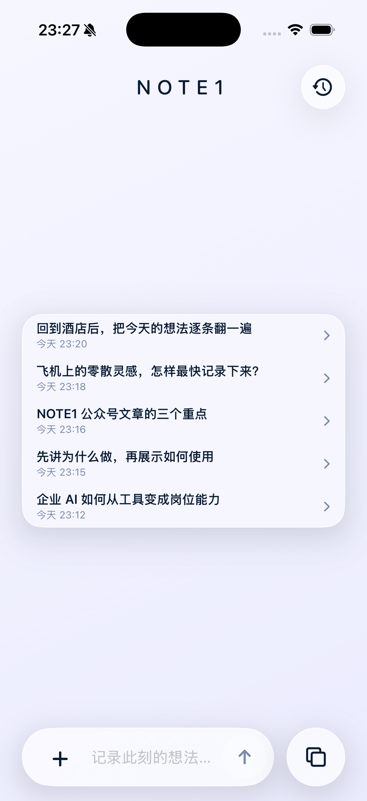
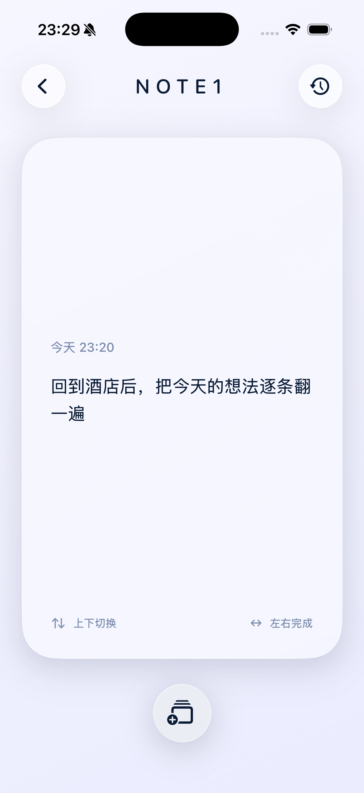
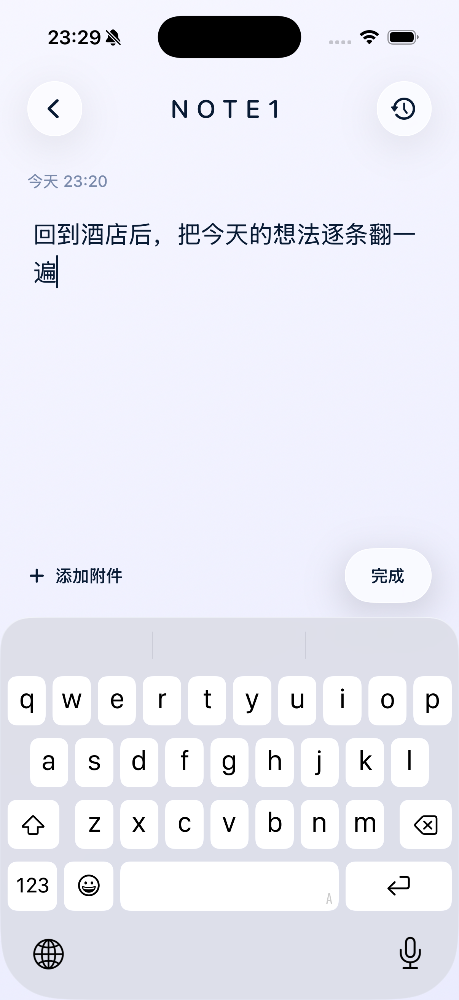
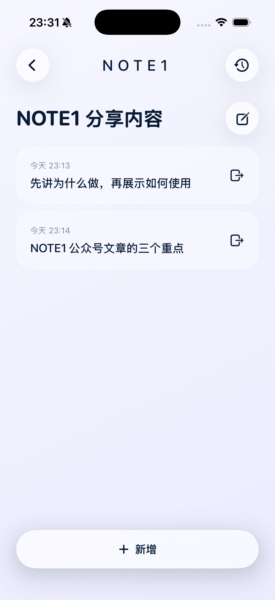
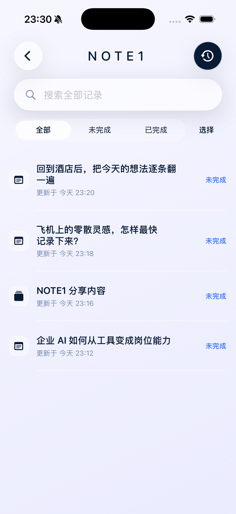

# 我做了一个只用来记录灵感的 iOS App

> 文档用途：公众号推广资料

我用 Codex 做了一款 iOS 软件，叫 NOTE1。

它做的事情很简单：帮我快速记下灵感，再在有空的时候，一条条翻回来继续想。

## 为什么要做 NOTE1

我平时会冒出很多点子。

有时候在飞机上，有时候在火车上。一个念头突然出现，如果当时不记下来，过一会儿可能就忘了。

以前我会把它们放进手机备忘录，或者发到微信文件传输助手里。但时间一长，工作内容、临时消息和各种零散记录混在一起，越来越乱。想再把某个点子找回来，很难；想把它们集中翻一遍，也不方便。

所以我想做一个更简单的东西。

在灵感出现的时候，只负责快速记下来；回到酒店，有一段完整的空余时间，再慢慢翻阅。重新看到当时写下的那句话，回想当时为什么会有这个念头，再由它激发新的灵感。

有些灵感最后会写成文章，有些会被做成一个具体的东西。

这就是 NOTE1 的主旨。

## 我是怎么呈现的

NOTE1 的整体风格只有一个关键词：极简。

打开后可以直接输入，不需要先选分类，也没有复杂的设置。写完保存，灵感就进入自己的记录里。

首页只保留最近几条内容，方便我马上继续补充。想集中回看时，就进入卡片界面，一次只看一条。

在当前实现里，上下滑动用来切换上一条和下一条；左右滑动用来完成当前内容。整个过程很像刷短视频，但这里看到的不是别人推给我的内容，而是我自己曾经记录下来的想法。

如果某条灵感还值得继续，我可以直接点开补充；如果几条内容属于同一个方向，也可以把它们放进同一个灵感组。

历史页面用来统一查找未完成和已完成的记录，也可以搜索、恢复或删除。

我希望它一直保持简单：快速录入，快速查阅，快速翻阅。

## 目前还不会上架

现在 NOTE1 只是以测试开发者的方式运行在我自己的 iPhone 里。

iOS 开发者每年需要交大约 100 美元，对我来说还是挺贵的。所以我暂时没有直接上架 App Store。

我发这篇文章和演示视频，主要是想把它分享出来，看看大家真实使用时还需要什么，有没有值得补充和优化的地方。

这件事是纯公益的，我没有给它设定商业化目标。后面要不要正式上架，会根据大家的反馈和实际需求量再决定。

如果你也有很多零散灵感，欢迎告诉我：你会在什么场景下用它，还希望它补充什么功能。
